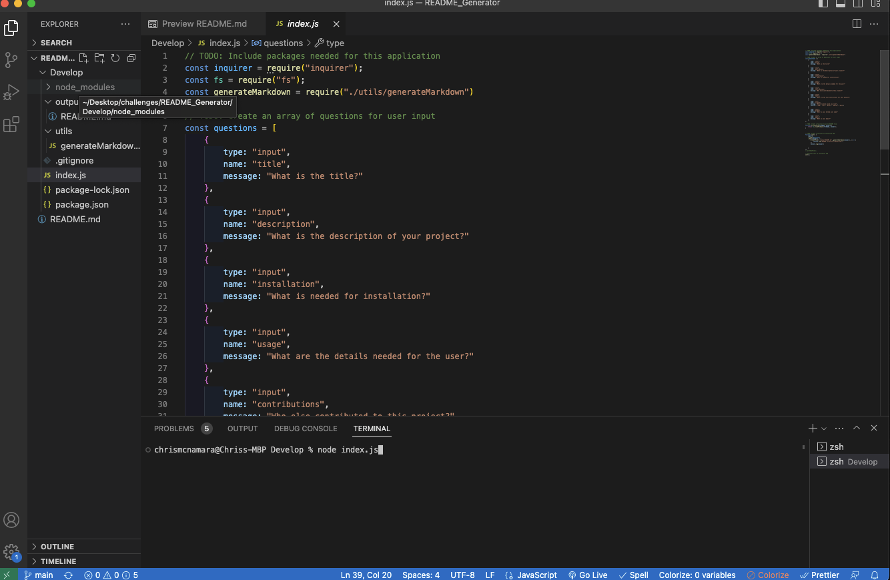
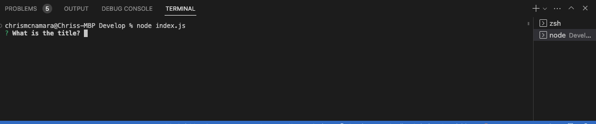
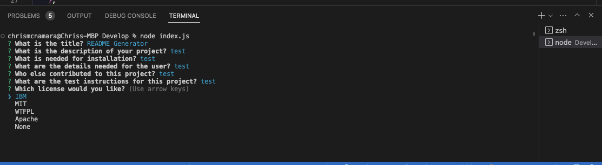
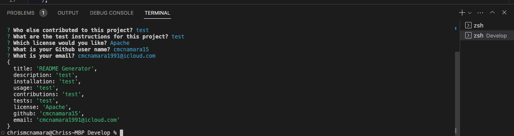
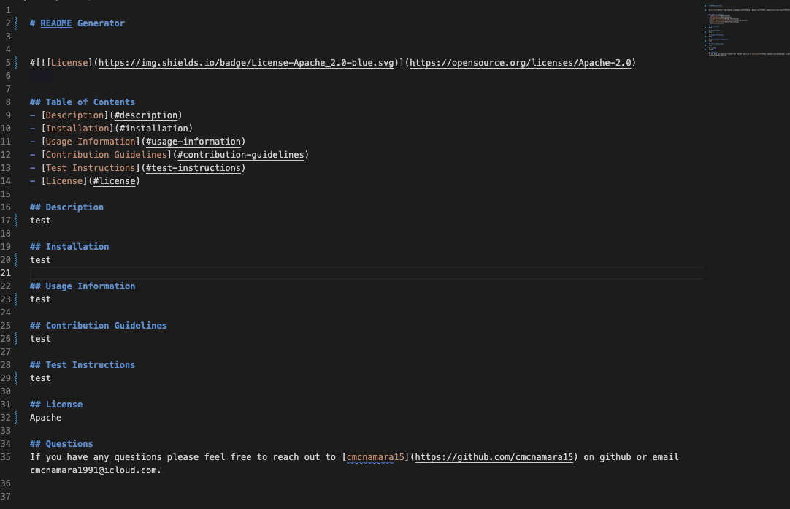
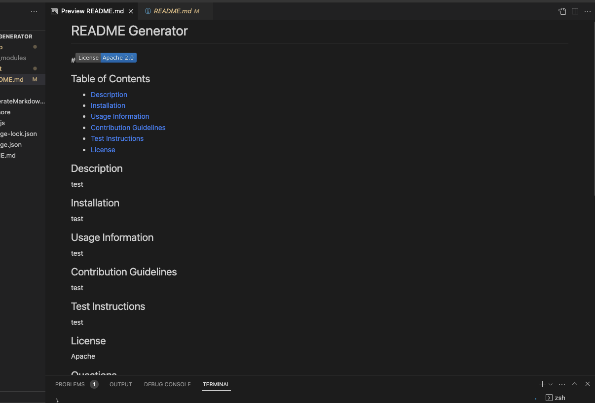

# README_Generator

## Description
This project was built with the direction of challenge in the UT Full Stack Coding Bootcamp. Using starter code I built a 
command line application that accepts user input and takes that input to generate a professional README file. Using NodeJS and one of its children packages Inquirer, I wrote code in JS to ultimately output a file that passes as a professional README.md. 
As a user, it is important to understand the basic formatting of markdown and what is important in a README file. Information collected from the user includes: Title, Description, Installation, Usage Information, Contribution Guidelines, Test Instructions and a choice for a license badge.

## Table of Contents    
- [Description](#description)
- [Demo Video](#demo-video)
- [Repo URL](#repo-url)
- [Installation](#installation)
- [Usage Information](#usage-information)
- [Contribution Guidelines](#contribution-guidelines)
- [Test Instructions](#test-instructions)
- [License](#license)
- [Screenshots](#screenshots)
- [README Documentation](#readme-docmentation)

## Demo Video 
[Demo Video](https://drive.google.com/file/d/1hww-FkNA1SKzKSKRwem9hJCfEKdfHxFg/view) 

## REPO URL
[Repository URL](https://github.com/cmcnamara15/README_Generator) 

## Installation
Nodejs & Inquirer@6.3.1 

## Usage Information
The user should be familiar with the basic formatting of README files. 

## Contribution Guidelines 
Starter code was obtained from the UT Full Stack Coding Bootcamp. Open to collaboration and contribution. 

## Test Instructions
none

## License
None

## Questions 
If you have any questions please feel free to reach out. 

Github: [cmcnamara15](https://github.com/cmcnamara15) 
Email: cmcnamara1991@icloud.com

## Screenshots

The following screenshots shows the apps functionality. 

## Node in terminal 

## Inquirer prompts running in node 

## License choices 

## Inquirer prompts complete 

## README output 

## README output as preview 

# README Documentation

[How to create a Professional README](https://coding-boot-camp.github.io/full-stack/github/professional-readme-guide)

